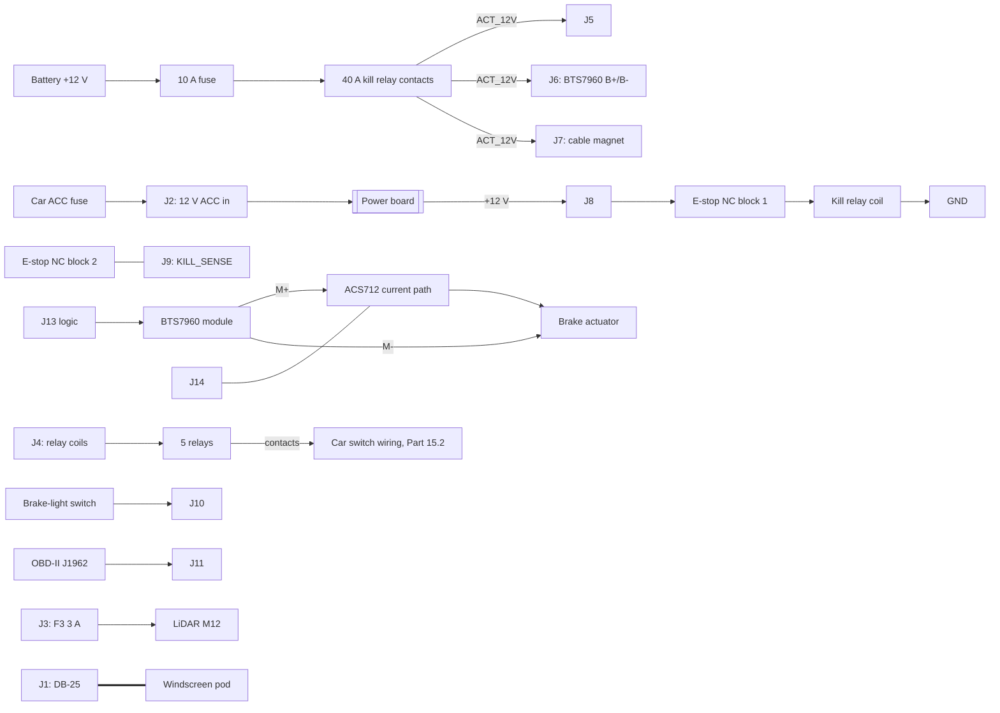

<!-- Generated by hardware/gen/assembly.py from hardware/gen/{power,pod}_board.py. Do not edit: change the board description or the generator, then run it. -->

# Power box: wiring

BUILD_GUIDE Part 4.8.4 and 4.8.6. Everything inside the box that is not on the power board, and
every wire that leaves it. Wire sizes: the actuator path (battery -> 10 A fuse -> kill relay ->
J5/J6 -> BTS7960 -> ACS712 -> actuator) in 2.5 mm²; the 12 V logic feed and relay coils in
0.75 mm²; signals in the DB-25 cable.

| Ref | Board label | Pin: net | Wired to |
|---|---|---|---|
| J1 | DB-25 to pod | 1 5V_POD, 2 5V_POD, 3 GND, 4 GND, 6 GND, 11 GND, 25 GND, SH GND, 5 BRAKE_RPWM, 7 BRAKE_LPWM, 8 BRAKE_EN, 9 MAGNET_EN, 10 BRAKE_CURRENT, 12 KILL_SENSE, 13 BOX_PRESENT, 14 RELAY_LEFT, 15 RELAY_RIGHT, 16 RELAY_HAZARD, 17 RELAY_HORN, 18 RELAY_BEAM, 19 BRAKE_LIGHT, 20 CAN_TX, 21 CAN_RX, 22 CAN_STBY, 23 HX711_DOUT, 24 HX711_SCK | the inter-box DB-25 cable to the pod (shield bonded here only) |
| J2 | 12 V ACC in | 1 ACC_IN, 2 GND | switched ACC (ignition) feed from the car's fuse box (its own fuse there too); ground to the chassis ground stud |
| J3 | LiDAR 12 V out | 1 LIDAR_12V, 2 GND | the LiDAR's 12 V via its M12 power cable (fused here by F3, 3 A) |
| J4 | Relay coils | 1 +12V, 2 COIL_LEFT, 3 COIL_RIGHT, 4 COIL_HAZARD, 5 COIL_HORN, 6 COIL_BEAM | pin 1 to the five relays' coil commons (+12 V); pins 2-6 to the coil returns of LEFT, RIGHT, HAZARD, HORN, BEAM |
| J5 | Actuator 12 V from kill relay | 1 ACT_12V, 2 GND | the 40 A kill relay's switched contact (ACT_12V) and ground: battery -> 10 A fuse -> kill relay contacts -> here |
| J6 | BTS7960 B+ / B- | 1 ACT_12V, 2 GND | the BTS7960 module's B+ and B- (its motor supply) |
| J7 | Cable magnet | 1 ACT_12V, 2 MAG_NEG | the cable magnet (12 V holding magnet), + to ACT_12V, - to MAG_NEG |
| J8 | Kill relay coil feed | 1 +12V, 2 GND | +12 V -> E-stop contact block 1 (NC) -> 40 A kill relay coil -> ground |
| J9 | E-stop sense contact | 1 KILL_SENSE, 2 GND | E-stop contact block 2 (NC): KILL_SENSE and ground |
| J10 | Brake-light switch | 1 BL_IN, 2 GND | the brake-light switch's lamp side (12 V when the pedal is pressed) and ground |
| J11 | OBD-II lead | 1 OBD_CANH, 2 OBD_CANL, 3 GND | the OBD-II lead: J1962 pin 6 CAN_H, pin 14 CAN_L, pins 4/5 ground (~0.5 m) |
| J12 | Bench: HX711 | 1 +5V, 2 HX711_DOUT, 3 HX711_SCK, 4 GND | bench only: the HX711 load-cell amplifier (VCC, DOUT, SCK, GND) |
| J13 | BTS7960 module | 1 RPWM_5V, 2 LPWM_5V, 3 EN_5V, 4 EN_5V, 7 +5V, 8 GND | the BTS7960 module's logic header (RPWM LPWM R_EN L_EN R_IS L_IS VCC GND) |
| J14 | ACS712 module | 1 +5V, 2 ACS_OUT, 3 GND | the ACS712-20A module (VCC, OUT, GND); its current path in series with the actuator |

Checks, in order, before the box is closed:
1. With no battery feed: the kill relay coil circuit (J8 -> E-stop -> coil -> GND) by continuity,
   E-stop released: closed; pressed: open.
2. J9's pair: E-stop released: closed; pressed: open (the **second** contact block, independent of
   the first).
3. The actuator path: ACT_12V to GND is not a short (the reading climbs as the BTS7960 module's
   capacitors charge from the meter: that is expected; a steady few ohms is not).
4. Bring-up per `power_board_bringup.md` step 6, then the bench rig.
